<p align="center">
  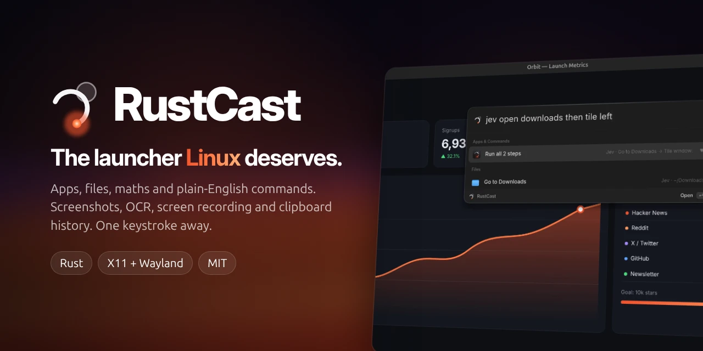
</p>

<p align="center">
  <a href="https://github.com/shashank03-dev/rustcast/releases/latest"></a>
  <a href="https://github.com/shashank03-dev/rustcast/actions/workflows/ci.yml"></a>
  <a href="LICENSE.md"></a>
  
  
</p>

<p align="center">
  <a href="#install"><b>Install</b></a> ·
  <a href="#features"><b>Features</b></a> ·
  <a href="#hotkeys"><b>Hotkeys</b></a> ·
  <a href="#configuration"><b>Configuration</b></a> ·
  <a href="#contributing"><b>Contributing</b></a>
</p>

<br>

**RustCast** is a fast, keyboard-first launcher for Linux. Press <kbd>Alt</kbd> + <kbd>Space</kbd>
to open apps, find files, do maths or just say what you want in plain words. It also
ships a full screenshot studio, text recognition (OCR), a window-locking screen
recorder and clipboard history, all in one small native app written in Rust.

<p align="center">
  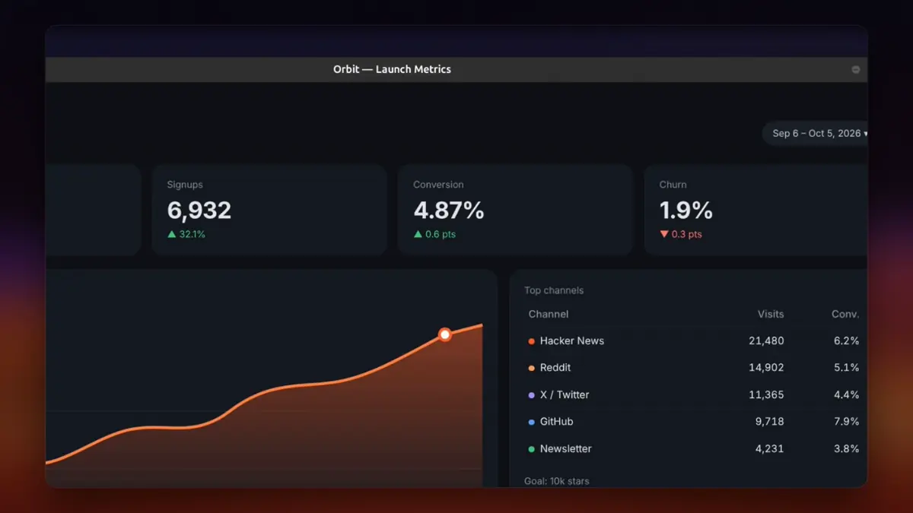
</p>

## Why RustCast

- **One shortcut for everything.** Apps, files, maths, emoji, screenshots, recordings and
  your clipboard live behind the same keystroke.
- **Native and light.** A single Rust binary. Heavy tools like OCR and the screenshot
  editor start only when you use them and exit straight after, so the launcher itself
  stays small.
- **Private by default.** Everything runs on your machine. Text recognition happens
  locally with Tesseract. Nothing is uploaded unless you ask for it.
- **Made for Linux.** Works on X11 and on GNOME/Wayland through XWayland, follows your
  desktop's apps, icons and file manager, and registers proper GNOME shortcuts.

## Features

### ⚡ Launcher

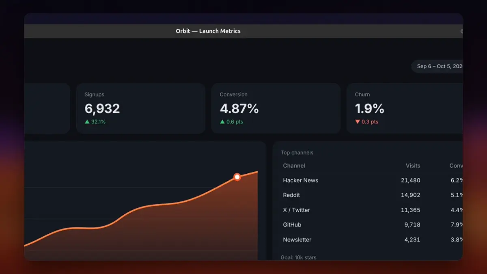

Start typing and RustCast finds it:

- **Apps** from your desktop entries, ranked by how often you use them
- **Files and folders** in the places you choose
- **Maths** like `1280 * 3 / 4` and **unit conversion** like `10 km to miles`.
  Press <kbd>Enter</kbd> to copy the answer.
- **Emoji**: type `fire`, press <kbd>Enter</kbd>, paste 🔥
- **Web search** for anything else, with your search engine of choice
- **Commands** to capture, record, tile windows, quit apps and more

<br clear="right">

### 🗣️ Jev: say what you want

Type `jev` and describe what you need in plain words. Jev turns it into actions you
run with <kbd>Enter</kbd>, and chains several steps into one.

<p align="center">
  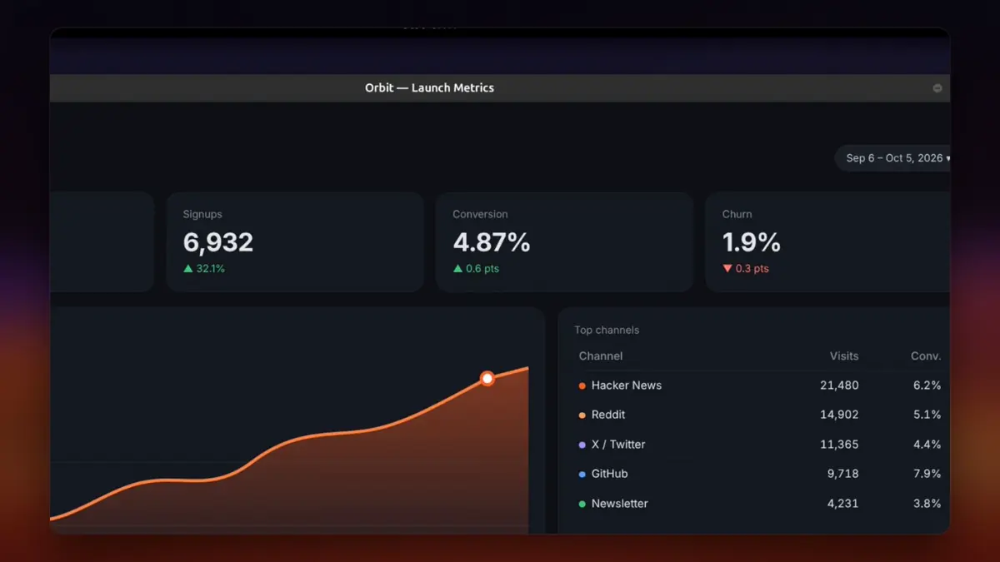
</p>

| You type | Jev does |
|---|---|
| `jev open downloads` · `jev go to desktop/projects` | Opens folders, even nested ones |
| `jev open report.pdf in documents` · `jev find invoice` | Finds and opens files |
| `jev launch firefox` · `jev switch to terminal` · `jev close spotify` | Controls apps and windows |
| `jev create folder Ideas on desktop` · `jev make todo.txt` | Creates folders and files |
| `jev tile left` · `jev show desktop` | Manages windows |
| `jev screenshot firefox in 5 seconds` · `jev copy table from screen` | Captures |
| `jev record firefox` · `jev stop recording` | Records |
| `jev open downloads and firefox then show desktop` | Runs several steps at once |

<details>
<summary>More Jev examples</summary>
<br>
<p align="center">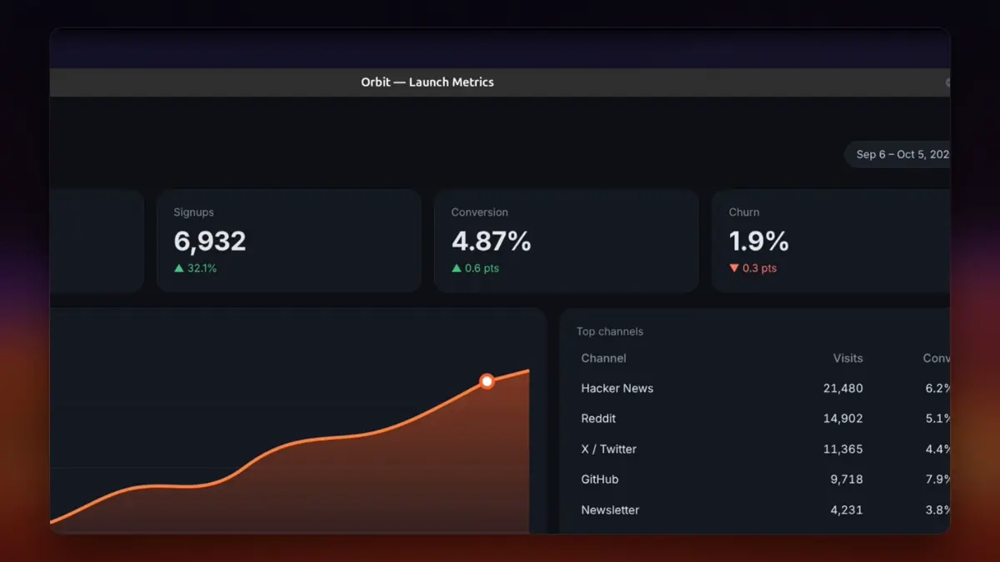</p>
</details>

### 📸 Screenshot studio

<kbd>Super</kbd> + <kbd>Shift</kbd> + <kbd>S</kbd> freezes the screen. Drag to select, click
a window, or press <kbd>F</kbd> for the whole screen. A magnifier shows exact pixels and
colours. Then mark it up right there, without opening another app.

<p align="center">
  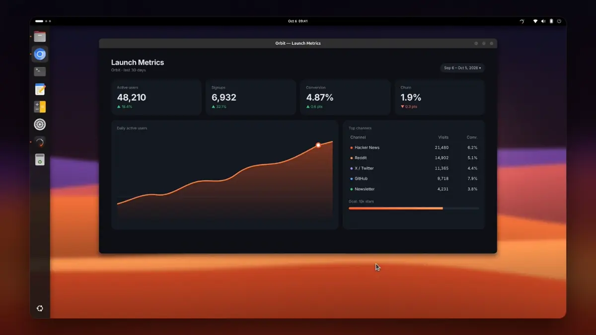
</p>

| Key | Tool | Key | Tool |
|:---:|---|:---:|---|
| <kbd>A</kbd> | Arrow | <kbd>T</kbd> | Text (click again to edit) |
| <kbd>L</kbd> | Line | <kbd>N</kbd> | Numbered steps 1, 2, 3… |
| <kbd>R</kbd> | Rectangle (outline or filled) | <kbd>B</kbd> | Censor: pixelate, blur or solid |
| <kbd>O</kbd> | Ellipse | <kbd>H</kbd> | Spotlight (dims everything else) |
| <kbd>P</kbd> | Pen | <kbd>I</kbd> | Colour picker (copies `#RRGGBB`) |
| <kbd>M</kbd> | Highlighter | <kbd>V</kbd> | Select, move, recolour, delete |

Finish with <kbd>Enter</kbd> to copy, <kbd>Ctrl</kbd>+<kbd>S</kbd> to save,
<kbd>Ctrl</kbd>+<kbd>P</kbd> to **pin** it above every window, or <kbd>Ctrl</kbd>+<kbd>B</kbd>
to **beautify** it with a gradient backdrop, padding, rounded corners and a shadow.
Every capture then floats as a thumbnail you can **drag straight into any app**.

<table>
  <tr>
    <td width="50%"><br><b>Censor and pin.</b> Hide private details, then keep the capture floating on top while you work.</td>
    <td width="50%">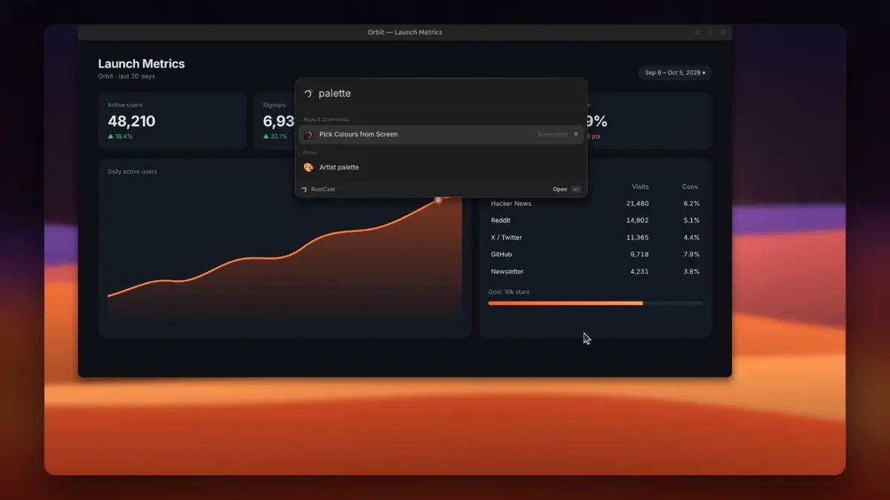<br><b>Colour palette.</b> Pick the dominant colours from any area as HEX, RGB, HSL or CSS variables.</td>
  </tr>
  <tr>
    <td colspan="2">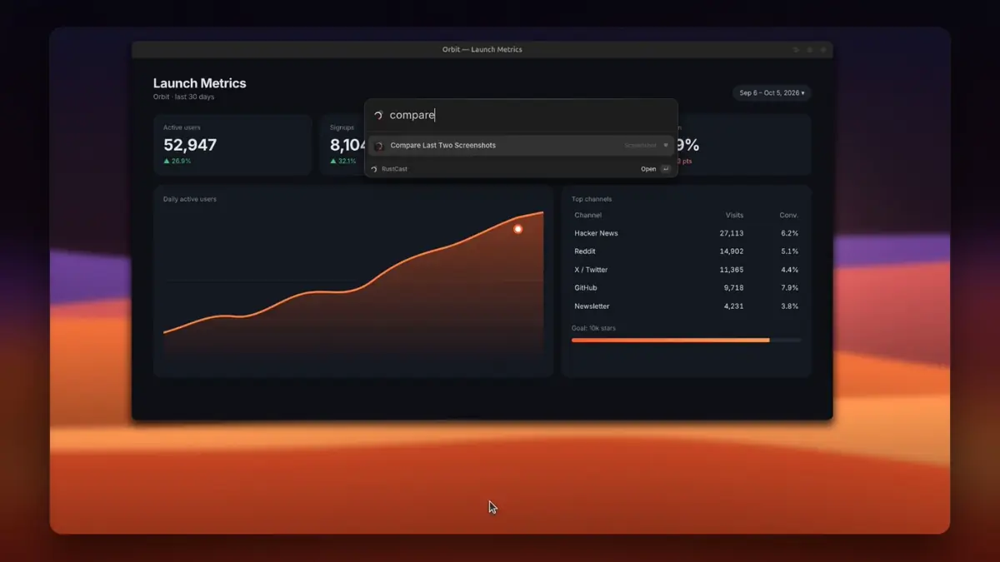<br><b>Compare.</b> Put your last two screenshots side by side, scrub a before/after slider, or see every changed area numbered.</td>
  </tr>
</table>

### 🔤 Copy text from anything

<kbd>Super</kbd> + <kbd>Shift</kbd> + <kbd>T</kbd>, select an area, and the text is on your
clipboard. It works on images, videos, terminals, dark themes and PDFs, and it runs
entirely on your machine.

<p align="center">
  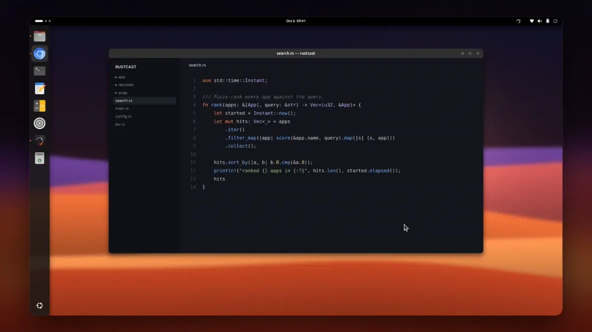
</p>

<table>
  <tr>
    <td width="50%">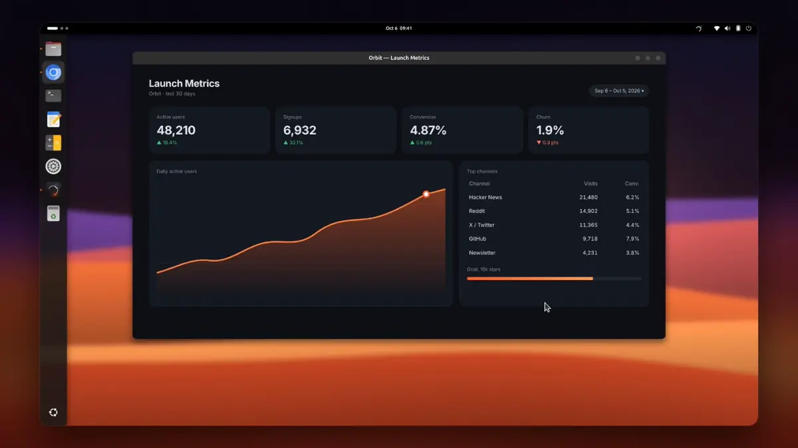<br><b>Tables.</b> Real rows and columns that paste into a spreadsheet, or save as CSV.</td>
    <td width="50%">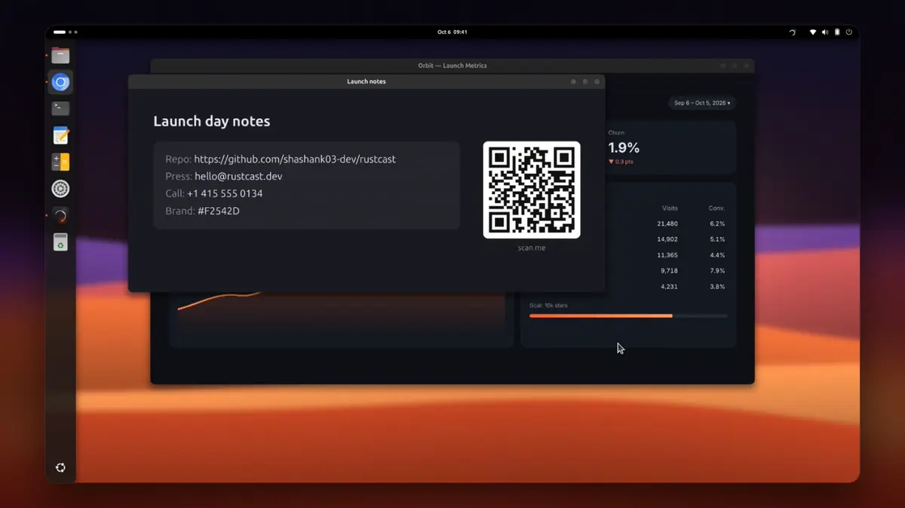<br><b>Smart actions.</b> Links, emails, phone numbers, colours, sums and QR codes become one-click buttons.</td>
  </tr>
</table>

Choose **Text**, **Code** (indentation rebuilt exactly) or **Table**. Any Tesseract
language works, e.g. `ocr_languages = "eng+hin"`.

### 🎥 Screen recorder

<kbd>Super</kbd> + <kbd>Shift</kbd> + <kbd>R</kbd> opens the recorder. Lock onto one window
and the video shows **only that window**: anything you drag over it never appears, and
neither does RustCast.

<p align="center">
  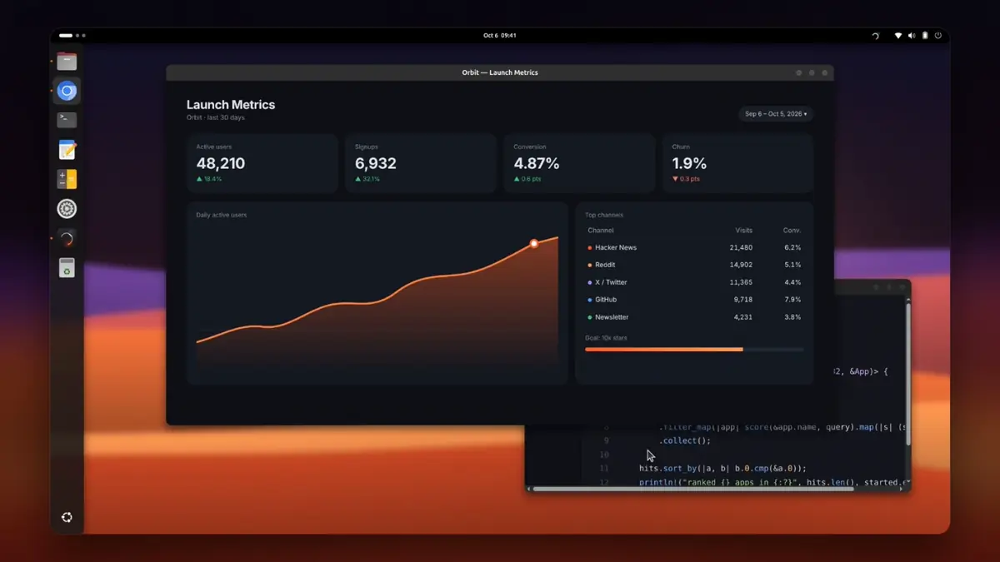
</p>

- **Follows the window** when you move it, switch workspaces or even minimise it
- **Add more windows** mid-recording, placed where they are or as picture-in-picture tiles
- **Full-screen** recording of any monitor, with RustCast painted out of every frame
- **Fixed output size** (1920×1080 by default), so resizing never changes the video
- **Safe by design**: closing the window, logging out or a crash still saves the video
  and restores your windows

### 📋 Clipboard history

<kbd>Super</kbd> + <kbd>Shift</kbd> + <kbd>C</kbd> shows everything you've copied, text and
images, with a large preview. Filter with <kbd>←</kbd> <kbd>→</kbd>, type to search, and
press <kbd>Ctrl</kbd>+<kbd>1</kbd>…<kbd>9</kbd> for quick picks. History is kept on disk,
so it survives restarts.

<p align="center">
  
</p>

## Install

### Download a release

Get `rustcast-v*-x86_64-linux.tar.gz` from the
[latest release](https://github.com/shashank03-dev/rustcast/releases/latest), then:

```sh
tar xzf rustcast-v*-x86_64-linux.tar.gz
cd rustcast-v*-x86_64-linux
./install.sh --start
```

This installs RustCast to `~/.local/bin`, adds it to your app grid, starts it on login
and launches it now. Remove it any time with `./uninstall.sh`.

### Build from source

You need [Rust](https://www.rust-lang.org/tools/install) and the development packages below.

```sh
git clone https://github.com/shashank03-dev/rustcast
cd rustcast
make install-start     # build, install, enable autostart and launch
```

`make install` does the same without launching, and `make uninstall` removes everything.

### Dependencies

<details open>
<summary><b>Ubuntu / Debian</b></summary>

```sh
sudo apt install libgtk-3-dev libayatana-appindicator3-1 libxcb1-dev libxtst-dev \
                 tesseract-ocr ffmpeg gstreamer1.0-pipewire libnotify-bin
```
</details>

<details>
<summary><b>Fedora</b></summary>

```sh
sudo dnf install gtk3-devel libayatana-appindicator-gtk3 libxcb-devel libXtst-devel \
                 tesseract ffmpeg-free pipewire-gstreamer libnotify
```
</details>

<details>
<summary><b>Arch Linux</b></summary>

```sh
sudo pacman -S gtk3 libayatana-appindicator libxcb libxtst \
               tesseract tesseract-data-eng ffmpeg gst-plugin-pipewire libnotify
```
</details>

Release downloads only need the runtime libraries; the `-dev` / `-devel` packages are for
building. Tesseract is only needed for OCR and ffmpeg only for the recorder.

<details>
<summary>What each package is for</summary>

| Package | Used for |
|---|---|
| GTK 3, Ayatana AppIndicator | Tray icon, screenshot editor, OCR window |
| libxcb, libXtst | Windows, hotkeys, tiling, pasting (X11 / XWayland) |
| Tesseract | Text recognition. Add `tesseract-ocr-<lang>` for more languages. |
| ffmpeg | Encoding screen recordings |
| PipeWire GStreamer plugin | Recording native Wayland windows through the system picker |
| libnotify | "Recording saved" and similar notifications |
| `translate-shell` (optional) | Translating recognised text in place |
</details>

### Compatibility

| Desktop | Status |
|---|---|
| GNOME on Wayland (Ubuntu 24.04) | ✅ Tested. Hotkeys are registered as GNOME shortcuts. |
| GNOME / other desktops on X11 | ✅ Native X11 path |
| KDE Plasma, Xfce, Cinnamon | 🟡 Should work through X11 / XWayland. Reports welcome. |
| Wayland-only compositors without XWayland | ❌ Not supported |

## Hotkeys

| Action | Default |
|---|---|
| Open the launcher | <kbd>Alt</kbd> + <kbd>Space</kbd> |
| Clipboard history | <kbd>Super</kbd> + <kbd>Shift</kbd> + <kbd>C</kbd> |
| Screenshot | <kbd>Super</kbd> + <kbd>Shift</kbd> + <kbd>S</kbd> |
| Copy text from screen | <kbd>Super</kbd> + <kbd>Shift</kbd> + <kbd>T</kbd> |
| Screen recorder (press again to stop) | <kbd>Super</kbd> + <kbd>Shift</kbd> + <kbd>R</kbd> |

Change them in **Preferences** (tray menu) or in `~/.config/rustcast/config.toml`.
Any capture mode can also be bound to a key of your own, such as <kbd>Print</kbd>, by
running `rustcast rustcast://capture/<mode>` with `area`, `window`, `fullscreen`,
`quick`, `ocr`, `ocr-code`, `ocr-table`, `palette` or `compare`.

## Configuration

RustCast creates `~/.config/rustcast/config.toml` on first run. Most settings are also
in **Preferences**.

<details>
<summary>Screenshot and recorder settings</summary>

```toml
screenshot_hotkey = "SUPER+SHIFT+S"
ocr_hotkey = "SUPER+SHIFT+T"
recorder_hotkey = "SUPER+SHIFT+R"

[screenshot]
save_dir = "~/Pictures/Screenshots"
format = "png"                # png, jpg or webp
jpeg_quality = 90
enter_action = "copy"         # what Enter does in the editor: copy or save
show_magnifier = true
window_snap = true            # click a window to capture it (X11)
ocr_languages = "eng"         # Tesseract codes, e.g. "eng+hin+deu"
translate_to = ""             # empty = system language
show_thumbnail = true
thumbnail_seconds = 10        # 0 = stays until you close it

[recorder]
fps = 30
aspect_lock = true            # fit every frame into output_width × output_height
output_width = 1920
output_height = 1080
keep_recording_when_minimized = true
show_cursor = true
record_audio = false
show_indicator = true         # floating ● REC pill
picture_in_picture = false    # layout for windows added to a locked recording
output_dir = "~/Videos/RustCast"
```
</details>

<details>
<summary>Search, theme and clipboard settings</summary>

[`docs/default.toml`](docs/default.toml) shows the main defaults and
[`docs/config.toml`](docs/config.toml) is an example with modes, aliases and shell
commands. Anything you leave out of your config keeps its default.
</details>

## Privacy

RustCast works offline. It only goes online when you ask it to:

- **Web search** opens your browser with the search engine you configured
- **Translate** in the OCR window uses `translate-shell` if installed, otherwise opens
  Google Translate in your browser
- **Jev's smart fallback** is off unless you add an AI Gateway key
  (`AI_GATEWAY_API_KEY` or `~/.config/rustcast/ai_gateway_key`). When enabled, only the
  sentence you typed is sent, and only when Jev can't work it out itself.

## Known limitations

<details>
<summary>Show the list</summary>

- **Window tiling** works for X11 / XWayland windows. Native-Wayland-only windows can't be
  moved by other apps, by design.
- **Drag and drop** from the capture thumbnail targets X11 / XWayland apps; some
  native-Wayland-only apps may not accept the drop.
- **Recorder on Wayland**: native-Wayland windows are recorded through the system picker,
  so minimising and adding windows only work for X11 / XWayland windows. In a Wayland
  full-screen recording the compositor draws everything, so the ● REC pill is hidden
  (stop with the hotkey) and opening the launcher mid-recording will show in the video.
- **Screenshots on Wayland** go through the desktop portal. Clicking a window to capture
  it needs X11; on Wayland, drag around the window instead.
- The **Events** page is empty for now; there's no portable Linux calendar source wired up yet.
</details>

## Development

```sh
cargo run                  # debug build
cargo test                 # unit tests
cargo clippy --all-targets
cargo fmt --all
```

<details>
<summary>Live recorder tests</summary>

These need an X server, a window manager and ffmpeg. They create their own windows and
check real video pixels: overlaps never leak into a locked recording, added windows do
appear, RustCast never appears, and minimised or other-workspace windows keep recording.

```sh
Xvfb :99 & DISPLAY=:99 openbox &
cargo build
DISPLAY=:99 cargo test recorder::live -- --ignored --test-threads=1
```
</details>

<details>
<summary>Project layout</summary>

| Path | What's there |
|---|---|
| `src/app/` | Launcher window, pages (clipboard, recorder, settings, emoji) and tray menu |
| `src/jev.rs` | The Jev command parser |
| `src/snap/` | Screenshot overlay, annotation editor, OCR, palette, compare, pin |
| `src/recorder/` | X11 and portal capture, encoder and the ● REC pill |
| `src/platform/linux/` | Desktop entries, hotkeys, window management, overlays |
| `assets/brand/` | The RustCast logo (`scripts/brand/` regenerates it) |
| `launch-video/` | Scripts and the Remotion project behind the launch video |
</details>

## Contributing

Bug reports, ideas and pull requests are all welcome.

- Found a bug? [Open an issue](https://github.com/shashank03-dev/rustcast/issues/new/choose).
  The form asks for your distro and session type, which makes it much faster to fix.
- Want to help? Look for issues labelled
  [`good first issue`](https://github.com/shashank03-dev/rustcast/labels/good%20first%20issue)
  or [`help wanted`](https://github.com/shashank03-dev/rustcast/labels/help%20wanted).
- Before opening a pull request, read [CONTRIBUTING.md](CONTRIBUTING.md).

If RustCast saves you time, a ⭐ helps other people find it.

## License

RustCast is released under the [MIT License](LICENSE.md).
