<p align="center">
  
</p>

# RustCast for Linux (X11 / XWayland)

A Rust-powered productivity launcher for Linux: apps, files, commands and maths
from one keystroke, plus:

1. **Clipboard history** — everything you copy (text + images) is stored and shown
   on a hotkey (`Super+Shift+C`) in a full-size view: cards with type badges,
   a large preview with details, All / Text / Images filters (`←` `→`), typing
   to search, `↑` `↓` to browse, `Enter` to copy, `Ctrl+1…9` for quick picks. History is **persisted to disk** under
   `~/.local/share/rustcast/clipboard` and survives restarts.
2. **Screenshots with a built-in editor** — `Super+Shift+S` freezes the screen.
   Drag to select an area or click a window (`F` for the whole screen); a magnifier
   shows exact pixels and colours. Then annotate in place:

   | Key | Tool | Key | Tool |
   |---|---|---|---|
   | `A` | Arrow | `T` | Text (click again to re-edit) |
   | `L` | Line | `N` | Numbered steps 1, 2, 3… |
   | `R` | Rectangle (outline / filled) | `B` | Censor: pixelate · blur · solid |
   | `O` | Ellipse | `H` | Spotlight (dim everything else) |
   | `P` | Pen | `I` | Colour picker (copies `#RRGGBB`) |
   | `M` | Highlighter | `V` | Select, move, recolour, delete |

   `1`–`8` pick a colour, `Shift` draws straight lines / squares, arrow keys nudge
   the selection, `Ctrl+Z` / `Ctrl+Shift+Z` undo / redo. Finish with
   `Enter` / `Ctrl+C` (copy), `Ctrl+S` (save), `Ctrl+Shift+S` (save as),
   `Ctrl+P` (**pin** it on top of all windows), `Ctrl+T` (**copy the text**, OCR),
   `Ctrl+K` (**colour palette**) or `Ctrl+B` (**beautify**: gradient backdrop,
   padding, rounded corners, shadow).

   Every capture then slides in as a **floating thumbnail in the bottom-left
   corner** (above your dock/panel, on every workspace; several stack upwards).
   **Drag it straight into any application**, click it to annotate, or hover for
   **Copy · Save · Annotate · Pin · Copy Text · More** (Copy Code / Table, Extract
   Colours, Compare with Previous, Show in Folder, Move to Trash). It stays while
   you hover and otherwise leaves after `thumbnail_seconds` (0 = until closed), and
   hides itself during the next capture so it never ends up in a screenshot.
   Captures also land in the clipboard history.

3. **Copy text from anywhere (OCR)** — `Super+Shift+T`, select the text, done: it
   is on your clipboard (and in clipboard history) and shown in a small window
   where you can fix it, **translate** it or search it. Switch between **Text**,
   **Code** (indentation and spacing rebuilt exactly) and **Table** (real columns —
   pastes into spreadsheet cells, or *Save CSV*). Links, e-mail addresses, phone
   numbers, colours and sums found in the text become one-click actions; QR codes
   in the selection are decoded too. Works on dark themes and terminals, any Tesseract language
   (`ocr_languages = "eng+hin"`). Built for low-end machines: the engine runs only
   for the fraction of a second it needs (~40 MB, then fully released), the crop is
   piped in as compact grayscale — nothing stays in memory.

   More in the launcher: *Capture Window*, *Capture Full Screen*, *Quick Capture*
   (copy instantly), *Capture Area in 3 / 5 / 10 Seconds*, *Copy Code / Table from
   Screen*, *Pick Colours from Screen* (dominant colours as HEX / RGB / HSL or CSS
   variables), *Compare Last Two Screenshots* (before/after slider, side by side,
   or every changed area numbered with how much changed), *Open Screenshots Folder*.

   Or just ask Jev: `jev screenshot firefox` (brings that window up and captures
   it), `jev screenshot full screen in 5 seconds`, `jev copy code from screen`,
   `jev copy table`, `jev pick colors`, `jev compare screenshots`.

4. **Jev, the command operator** — type `jev` and say what you want in plain words.
   Jev turns it into actions you run with Enter:

   | You type | Jev does |
   |---|---|
   | `jev open downloads` · `jev go to desktop/projects` | opens folders (desktop, documents, `~/code`, nested paths…) |
   | `jev open report.pdf in documents` · `jev find invoice` | finds and opens files (things on your Desktop come first) |
   | `jev launch firefox` · `jev switch to terminal` · `jev close spotify` | apps and windows |
   | `jev create folder Ideas on desktop` · `jev make todo.txt` | makes folders / files and opens them |
   | `jev show desktop` · `jev tile left` · `jev screenshot` | window management |
   | `jev record firefox` · `jev record screen` · `jev stop recording` | the screen recorder |
   | `jev add terminal to recording` | bring a window into a locked recording |
   | `jev open downloads and firefox then show desktop` | several steps → a "Run all" row |

   Type just `jev` for examples.
5. **Screen recorder** (`Super+Shift+R`) — opens a recorder view laid out for the
   job: screen cards, a grid of window cards, switches for the options, and — while
   recording — a live banner with the timer and a big Stop button:
   - **Lock onto a window**: the recording follows that one app. Windows dragged
     over it never show up, moving it around doesn't matter, and nothing turns
     black. **Minimizing it keeps recording**: the window is hidden (invisible,
     click-through, behind everything) but keeps rendering; activate it from the
     dock to bring it back. It returns to minimized when you stop.
   - **Bring other windows in**: while a locked recording runs, press
     `Super+Shift+R` (or **＋ Add window** on the floating ● REC pill) and pick
     *Add … to Recording*. Added windows are drawn over the locked window exactly
     where you place them, or — with **Picture-in-Picture** — as tidy rounded
     corner tiles. Switch layouts or remove windows mid-recording.
   - **Full screen** recording of any monitor.
   - **A locked recording shows only the windows you chose** — the locked one
     and any you added. Nothing else ever gets in: not windows on top of it,
     not RustCast, and not the mouse pointer while you're working in another
     window (the pointer is drawn only when it's really over a recorded window).
   - **RustCast never appears in its own recordings.** A locked recording only
     reads the locked window, and RustCast's windows (launcher, ● REC pill,
     screenshot thumbnails) can't be locked onto or added. In full-screen
     recordings on X11 they are painted out of every frame and the windows
     underneath are rebuilt, so you can use RustCast while recording.
   - **Edge cases handled**: the locked window keeps recording when you switch
     workspaces (it follows you invisibly and goes back to its workspace);
     closing it ends the recording and saves the file; quitting RustCast,
     logging out or `kill` finish the video properly and restore any hidden
     window; a crash in the recorder can't leave a window invisible; video
     length always matches real time, even on a slow machine; if the pill
     crashes the recording continues (stop it with the hotkey).
   - **Aspect lock** (default 1920×1080): every frame is fitted into a fixed
     size, so resizing the window never changes the video.
   - Cursor, audio, FPS, output folder (`~/Videos/RustCast`) — in the page's
     quick toggles and Settings → Recorder.
   - Pressing the hotkey while recording stops it; the file is announced in a
     notification.

   Needs `ffmpeg`. On **GNOME/Wayland**, full-screen and native-Wayland windows
   are recorded through the system screen-sharing dialog (xdg-desktop-portal +
   PipeWire, needs `gstreamer1.0-pipewire`); X11/XWayland windows are locked onto
   directly and support minimizing and adding windows.

## Display server

This build targets **X11**. It runs natively on X11 sessions and on **GNOME/Wayland
through XWayland** (no configuration needed). Global hotkeys, window tiling, paste
injection, and drag-and-drop all rely on the X11 path.

## Install (recommended)

Installs RustCast as a background launcher: builds a release binary into
`~/.local/bin`, adds an app-grid launcher and icon, and enables autostart so the
tray is always running after login.

```sh
make install          # build + install + enable autostart
make install-start    # same, and launch it right now
make uninstall        # remove binary, launcher, autostart, GNOME hotkeys
```

On **GNOME** the global hotkeys are registered as GNOME custom keybindings
(`gsettings`) instead of in-process X11 grabs, so they fire reliably on Wayland
regardless of which app is focused. If your toggle key clashes with GNOME's
window menu (the default `Alt+Space`), the install clears that conflict.

## Build (manual)

```sh
cargo build --release
./target/release/rustcast
```

### System packages

Runtime/build dependencies (Debian/Ubuntu names):

```sh
sudo apt install libgtk-3-dev libxcb1-dev libxtst-dev tesseract-ocr \
                 ffmpeg gstreamer1.0-tools gstreamer1.0-pipewire libnotify-bin
```

- `libgtk-3-dev` / `ayatana-appindicator` — tray icon
- `libxtst` — paste injection (XTEST)
- `tesseract-ocr` — text recognition (add `tesseract-ocr-<lang>` for more
  languages); optional `translate-shell` translates OCR text in place
- `xdg-desktop-portal` — screen capture on Wayland (fallbacks: `grim`,
  `gnome-screenshot`, `spectacle`); on X11 the screen is read directly
- `ffmpeg` — video encoding for the screen recorder
- `gstreamer1.0-pipewire` — Wayland (portal) recordings
- X11/XCB — windowing, EWMH tiling, XDND drag source (via the pure-Rust `x11rb`)

## Default hotkeys

| Action | Hotkey |
|---|---|
| Toggle launcher | `Alt+Space` |
| Clipboard history | `Super+Shift+C` |
| Screenshot capture | `Super+Shift+S` |
| Copy text from screen (OCR) | `Super+Shift+T` |
| Screen recorder (again to stop) | `Super+Shift+R` |

All are configurable in `~/.config/rustcast/config.toml`.

## Config

The config file is created on first run at `~/.config/rustcast/config.toml`. It is
the same schema as upstream RustCast, with these added fields:

```toml
screenshot_hotkey = "SUPER+SHIFT+S"
ocr_hotkey = "SUPER+SHIFT+T"
recorder_hotkey = "SUPER+SHIFT+R"

[screenshot]
save_dir = "~/Pictures/Screenshots"
format = "png"                # png, jpg or webp
jpeg_quality = 90
enter_action = "copy"         # what Enter does in the overlay: copy or save
show_magnifier = true
window_snap = true            # click a window to capture it (X11)
ocr_languages = "eng"         # Tesseract codes, e.g. "eng+hin+deu"
translate_to = ""             # empty = system language
show_thumbnail = true
thumbnail_seconds = 10        # 0 = stays until you close it

[recorder]
fps = 30
aspect_lock = true            # fit every frame into output_width × output_height
output_width = 1920
output_height = 1080
keep_recording_when_minimized = true
show_cursor = true
record_audio = false
show_indicator = true         # floating ● REC pill
picture_in_picture = false    # layout for windows added to a locked recording
output_dir = "~/Videos/RustCast"
```

## Tests

```sh
cargo test                      # unit tests
# Live recorder tests (need an X server + window manager, ffmpeg):
Xvfb :99 & DISPLAY=:99 openbox &
cargo build                     # also exercises the real ● REC pill
DISPLAY=:99 cargo test recorder::live -- --ignored --test-threads=1
```

The live tests create their own windows and check real video pixels: overlaps
never leak into a locked recording, added windows do appear, RustCast windows
never appear (locked or full screen, including ones opening mid-recording),
minimized and other-workspace windows keep recording and are restored.

## Known limitations

- **Calendar `Events` page** is empty; there is no portable Linux calendar source
  wired up yet.
- **Window tiling** moves other apps' windows via EWMH; this works for X11/XWayland
  windows. Native-Wayland-only windows cannot be tiled (a Wayland security limit).
- **Drag-and-drop** drops onto X11/XWayland targets; a drop target that is a
  native-Wayland-only window may not accept the XDND drop.
- **Recorder on Wayland**: native-Wayland windows go through the system picker,
  so the minimize trick and adding windows only apply to X11/XWayland windows.
  In a Wayland *full-screen* recording the compositor draws everything, so
  RustCast can't paint itself out: the ● REC pill is not shown (stop with the
  hotkey) and opening the launcher mid-recording will appear in the video.
- App launching uses `.desktop` entries (`gio launch`) and `xdg-open`.
- **Screenshots on Wayland** are taken through the desktop portal; clicking a
  window to capture it needs X11 (on Wayland, drag around the window instead).
  The overlay covers the monitor under the pointer.

Any capture mode can be bound to a key of your own (e.g. Print) by running
`rustcast rustcast://capture/<mode>` with `<mode>` = `area`, `window`,
`fullscreen`, `quick`, `ocr`, `ocr-code`, `ocr-table`, `palette` or `compare`.

## Brand

The RustCast mark lives in `assets/brand/`: an open "cast" arc on a graphite
squircle, a glass lens that refracts the arc, and a rust ember at the arc's
leading end. `rustcast-mark-animated.svg` is the motion version (the arc draws
itself with the ember riding its head, the lens settles in, the ember glows);
it shows the final frame when reduced motion is on.

Regenerate everything from `scripts/brand/build_logo.py` (SVGs), then
`node scripts/brand/render.mjs` (needs Playwright) for `docs/icon.png` and the
`assets/icons/` set used by the tray, the About dialog and the desktop entry.
